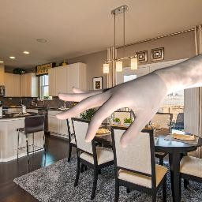

# Learning Joint Reconstruction of Hands and Manipulated Objects - Demo, Training Code and Models

Yana Hasson, Gül Varol, Dimitris Tzionas, Igor Kalevatykh, Michael J. Black,  Ivan Laptev, Cordelia Schmid, CVPR 2019

This code allows to **generate synthetic images** of **hands holding objects** as in the [ObMan](https://hassony2.github.io/obman) dataset.

In addition, hands-only images can also be generated, with hand-poses sampled randomly from the [MANO](http://mano.is.tue.mpg.de) hand pose space.

Examples of rendered images:

| Hands+Objects | Hands |
|---------------|-------|
|  |  |

Rendering generates:
- rgb images
- 3D ground truth for the hand and objects
- depth maps
- segmentation maps

For additional information about the project, see:

- [Project page](https://hassony2.github.io/obman)
- Code
  - [Robotic grasps generation using MANO](https://github.com/ikalevatykh/mano_grasp)
  - [Dataset repository](https://github.com/hassony2/obman)
  - [Training, evaluation and demo code](https://github.com/hassony2/obman_train)


# Installation

## Setup blender

- Download [Blender 2.78c](https://download.blender.org/release/Blender2.78/) (`wget https://download.blender.org/release/Blender2.78/blender-2.78c-linux-glibc219-x86_64.tar.bz2` for instance)
- untar `tar -xvf blender-2.78c-linux-glibc219-x86_64.tar.bz2`
- Download getpip.py: `wget https://bootstrap.pypa.io/get-pip.py`
- Try `blender-2.78c-linux-glibc219-x86_64/2.78/python/bin/python3.5m get-pip.py`
  - If this fails, try:
    - Install pip `path/to/blender-2.78c-linux-glibc219-x86_64/2.78/python/bin/python3.5m path/to/blender-2.78c-linux-glibc219-x86_64/2.78/python/lib/python3.5/ensurepip`
    - Try to update pip `path/to/blender-2.78c-linux-gliblender-2.78c-linux-glibc219-x86_64/2.78/python/bin/pip3 install --upgrade pip`
- Install dependencies
  - `path/to/blender-2.78c-linux-glibc219-x86_64/2.78/python/bin/pip install -r requirements.txt`

## Clone repository

```
git clone https://github.com/hassony2/obman_render
cd obman_render
```

## Download data dependencies

### Download hand and object pickle data-structures

#### Download [SURREAL](https://www.di.ens.fr/willow/research/surreal/data/) assets

- Go to SURREAL [dataset request page](https://www.di.ens.fr/willow/research/surreal/data/)
- Create an account, and receive an email with a username and password for data download
- Download SURREAL data dependencies using the following commands

```
cd download
sh download_smpl_data.sh ../assets username password
cd ..
```

#### Download MANO model

- Go to [MANO website](http://mano.is.tue.mpg.de/)
- Create an account by clicking *Sign Up* and provide your information
- Download Models and Code (the downloaded file should have the format mano_v*_*.zip). Note that all code and data from this download falls under the [MANO license](http://mano.is.tue.mpg.de/license).
- unzip the file mano_v*_*.zip: `unzip mano_v*_*.zip`
- set environment variable: `export MANO_LOCATION=/path/to/mano_v*_*`

#### Modify mano code to be Python3 compatible

- Remove `print 'FINITO'` at the end of file `webuser/smpl_handpca_wrapper.py` (line 144)

```diff
-    print 'FINITO'
```

- Replace `import cPickle as pickle` by `import pickle`

```diff
-    import cPickle as pickle
+    import pickle
```

  - at top of `webuser/smpl_handpca_wrapper.py` (line 23)
  - at top of `webuser/serialization.py` (line 30)
- Fix pickle encoding
  - in `webuser/smpl_handpca_wrapper.py` (line 74)

```diff
-    smpl_data = pickle.load(open(fname_or_dict))
+    smpl_data = pickle.load(open(fname_or_dict, 'rb'), encoding='latin1')
```

  - in `webuser/serialization.py` (line 90)

```diff
-    dd = pickle.load(open(fname_or_dict))
+    dd = pickle.load(open(fname_or_dict, 'rb'), encoding='latin1')
```

- Fix model paths in `webuser/smpl_handpca_wrapper.py` (line 81-84)

```diff
-    with open('/is/ps2/dtzionas/mano/models/MANO_LEFT.pkl', 'rb') as f:
-        hand_l = load(f)
-    with open('/is/ps2/dtzionas/mano/models/MANO_RIGHT.pkl', 'rb') as f:
-        hand_r = load(f)
+    with open('/path/to/mano_v*_*/models/MANO_LEFT.pkl', 'rb') as f:
+        hand_l = load(f, encoding='latin1')
+    with open('/path/to/mano_v*_*/models/MANO_RIGHT.pkl', 'rb') as f:
+        hand_r = load(f, encoding='latin1')
```

At the time of writing the instructions mano version is 1.2 so use 

```diff
-    with open('/is/ps2/dtzionas/mano/models/MANO_LEFT.pkl', 'rb') as f:
-        hand_l = load(f)
-    with open('/is/ps2/dtzionas/mano/models/MANO_RIGHT.pkl', 'rb') as f:
-        hand_r = load(f)
+    with open('/path/to/mano_v1_2/models/MANO_LEFT.pkl', 'rb') as f:
+        hand_l = load(f, encoding='latin1')
+    with open('/path/to/mano_v1_2/models/MANO_RIGHT.pkl', 'rb') as f:
+        hand_r = load(f, encoding='latin1')
```

#### Download SMPL model

- Go to [SMPL website](http://smpl.is.tue.mpg.de/)
- Create an account by clicking *Sign Up* and provide your information
- Download and unzip `SMPL for Python users`, copy the `models` folder to `assets/models`. Note that all code and data from this download falls under the [SMPL license](http://smpl.is.tue.mpg.de/license_body).

#### OPTIONAL : Download LSUN dataset (to generate images on LSUN backgrounds)

Download [LSUN](https://www.yf.io/p/lsun) dataset following the [instructions](https://www.yf.io/p/lsun).

#### OPTIONAL : Download ImageNet dataset (to generate images on ImageNet backgrounds)

- Download original images from [here](http://image-net.org/download)

#### Download body+hand textures and grasp information

- Request data on the [ObMan webpage](https://www.di.ens.fr/willow/research/obman/data/)

- Download grasp and texture zips

You should receive two links that will allow you to download `bodywithands.zip` and `shapenet_grasps.zip`.

- Unzip texture zip

```
cd assets/textures
mv path/to/downloaded/bodywithands.zip .
unzip bodywithands.zip
cd ../..
```

- Unzip the grasp information

```sh
cd assets/grasps
mv path/to/downloaded/shapenet_grasps.zip .
unzip shapenet_grasps.zip
cd ../../
```

- Your structure should look like this:

```
obman_render/
  assets/
    models/
      SMPLH_female.pkl
      basicModel_f_lbs_10_207_0_v1.0.2.fbx'
      basicModel_m_lbs_10_207_0_v1.0.2.fbx'
      ...
    grasps/
      shapenet_grasps/
      shapenet_grasps_splits.csv
    SURREAL/
      smpl_data/
      	smpl_data.npz
    ...
```

# Launch !

## Minimal version on white background

### Hands only

`path/to/blender -noaudio -t 1 -P blender_grasps_sacred.py -- '{"frame_nb": 10, "frame_start": 0, "results_root": "datageneration/tmp", "background_datasets": ["white"]}'`

### Grasping objects

`path/to/blender -noaudio -t 1 -P blender_hands_sacred.py -- '{"frame_nb": 10, "frame_start": 0, "results_root": "datageneration/tmp", "background_datasets": ["white"]}'`

## Full version with image backgrounds

### Hands only

`path/to/blender -noaudio -t 1 -P blender_hands_sacred.py -- '{"frame_nb": 10, "frame_start": 0, "results_root": "datageneration/tmp", "background_datasets": ["lsun", "imagenet"], "imagenet_path": "/path/to/imagenet", "lsun_path": "/path/to/lsun"}'`


### Grasping objects

`path/to/blender -noaudio -t 1 -P blender_grasps_sacred.py -- '{"frame_nb": 10, "frame_start": 0, "results_root": "datageneration/tmp", "background_datasets": ["lsun", "imagenet"], "imagenet_path": "/path/to/imagenet", "lsun_path": "/path/to/lsun"}'`

# Citations

If you find this code useful for your research, consider citing:

- the publication this code has been developped for

```
@INPROCEEDINGS{hasson19_obman,
  title     = {Learning joint reconstruction of hands and manipulated objects},
  author    = {Hasson, Yana and Varol, G{\"u}l and Tzionas, Dimitris and Kalevatykh, Igor and Black, Michael J. and Laptev, Ivan and Schmid, Cordelia},
  booktitle = {CVPR},
  year      = {2019}
}
```

- the publication it builds upon, for synthetic data generation of humans

```
@INPROCEEDINGS{varol17_surreal,  
  title     = {Learning from Synthetic Humans},  
  author    = {Varol, G{\"u}l and Romero, Javier and Martin, Xavier and Mahmood, Naureen and Black, Michael J. and Laptev, Ivan and Schmid, Cordelia},  
  booktitle = {CVPR},  
  year      = {2017}  
}
```

- the publication describing the used hand model: [MANO](http://mano.is.tue.mpg.de):

```
@article{MANO:SIGGRAPHASIA:2017,
  title = {Embodied Hands: Modeling and Capturing Hands and Bodies Together},
  author = {Romero, Javier and Tzionas, Dimitrios and Black, Michael J.},
  journal = {ACM Transactions on Graphics, (Proc. SIGGRAPH Asia)},
  publisher = {ACM},
  month = nov,
  year = {2017},
  url = {http://doi.acm.org/10.1145/3130800.3130883},
  month_numeric = {11}
}
```

